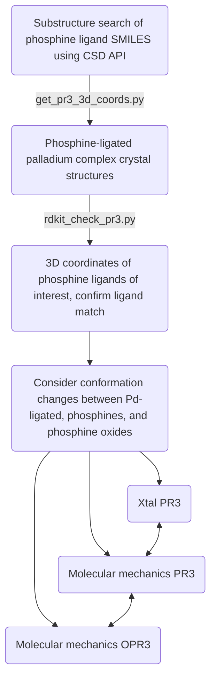

# Searching the Cambridge Structural Database for Relevant Crystal Structures

Purpose - showcase a method of searching for reported palladium complexes in the Cambridge Structural Database and then comparing to free ligand conformations.

